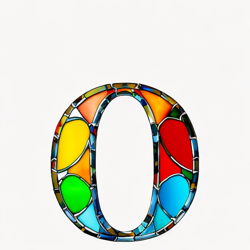
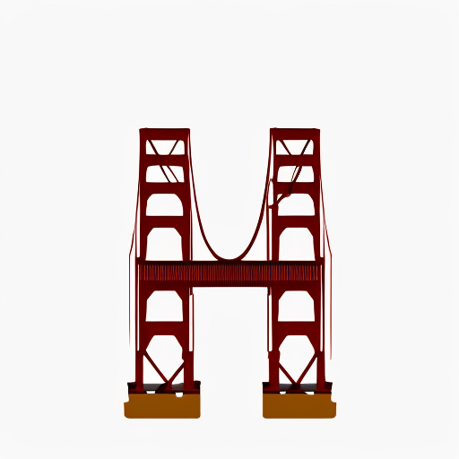

# Font Effects Generator 🎨

This project aims to create a tool for generating custom font effects using generative AI, inspired by Adobe's text effects tools. By leveraging inpainting models, it generates visually appealing font styles from text prompts.

---

## **Features**
- **Customizable Font Effects**: Generate fonts using detailed text prompts.
- **Inpainting Model**: Uses Stable Diffusion inpainting models to create the desired effects.
- **Fine-tuning Options**: Adjust initial font, prompt, and letter thickness for optimal results.

---

## **Examples**

### Generated Fonts (Words)
- **Prompt: "Colorful rainbow splashed around"**
  
  .png)

### Generated Fonts (Single Letters)
- **Prompt: "Colorful stained glass"**
  
  

- **Prompt: "Red Golden Gate Bridge"**
  
  

---

## **Project Structure**
```
.
├── Fonts
│   ├── DM_Serif_Display
│   ├── Lilita_One
│   ├── Roboto
│   ├── Roboto_Slab
│   └── Vollkorn
├── images
│   ├── adobe_express_imgs
│   └── results
├── README.md
└── font_effects_notebook.ipynb
```

---

## **Usage Instructions**
This project was designed to run in Google Colab. Follow these steps to use it:

1. **Upload the Notebook**:
   - Open [Google Colab](https://colab.research.google.com/).
   - Upload the `font_effects_notebook.ipynb` file.

2. **Set Up the Runtime**:
   - Go to `Runtime` > `Change runtime type`.
   - Select `GPU` and choose `T4` as the hardware accelerator.

3. **Upload Fonts**:
   - In the Colab file section, upload one of the font files from the `Fonts` directory (e.g., `LilitaOne-Regular.ttf`).
   - You can use a different font by modifying the font path in the notebook.

4. **Run the Notebook**:
   - Click `Runtime` > `Run all` to execute all cells.
   - The process may take up to 10 minutes during the first run.

5. **Troubleshooting**:
   - If the output image is blank, re-run the last section of the notebook.
   - If the issue persists, adjust the prompt to a more descriptive or visual one (e.g., "Colorful rainbow splashes").

---

## **Customization**
- **Prompt Selection**:
  - The quality of results heavily depends on the prompt.
  - Visual or descriptive prompts (e.g., "Blue and Yellow Van Gogh painting") tend to produce better results.

- **Font Selection**:
  - Fonts with thicker strokes generally yield better outputs.
  - Modify the input font in the notebook to experiment with different styles.

---

## **Limitations and Future Improvements**
- **Limitations**:
  - Inconsistent results with complex words or thin fonts.
  - Hardware constraints may affect performance and quality.

- **Future Improvements**:
  - Experiment with advanced inpainting models requiring higher computational resources.
  - Develop a less exact mask to introduce randomness around letters.
  - Explore more suitable fonts and enhanced prompt engineering.

---

## **Results Comparison**
Generated fonts were compared against Adobe Express Text Effects. While some results are visually competitive, commercial tools often produce superior outcomes due to advanced engineering and resource availability.

---

## **License**
This project is released under the MIT License. Feel free to use and modify the code for your own purposes.

---

## **Acknowledgments**
- Adobe Express for inspiring the project.
- [Stable Diffusion](https://stability.ai/) for the inpainting models used.
